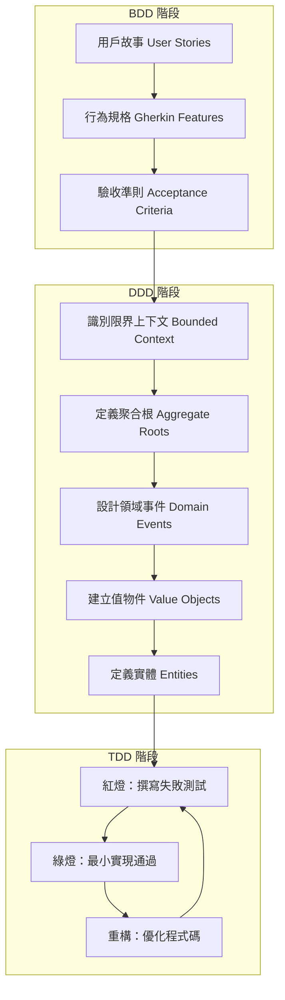
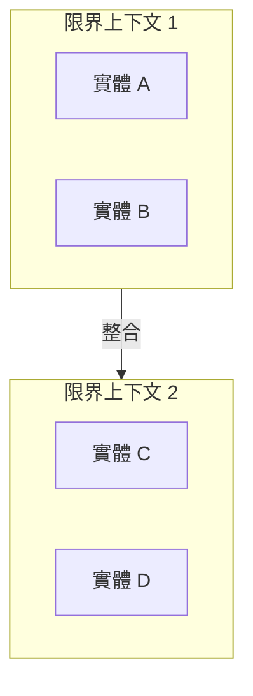
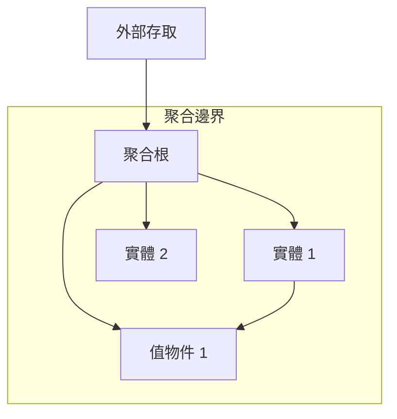
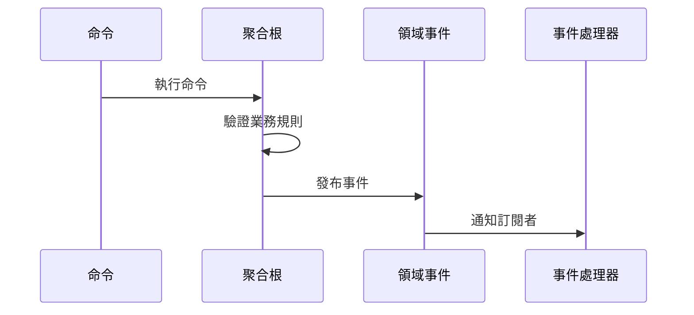
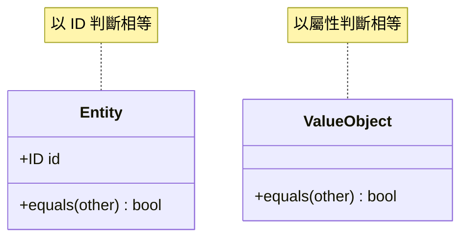
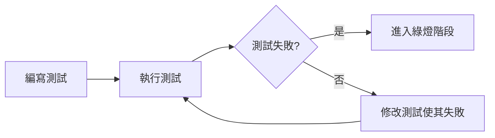
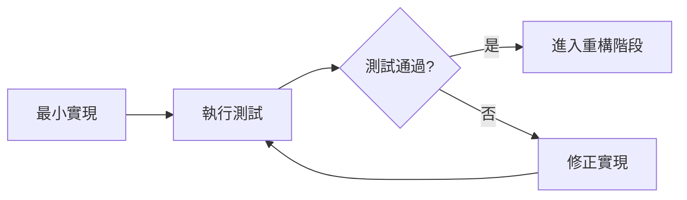
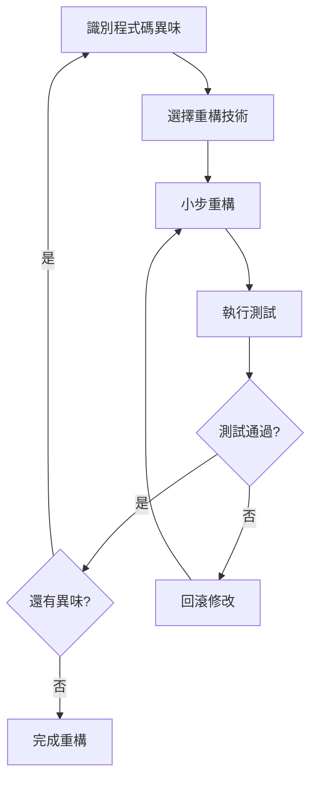
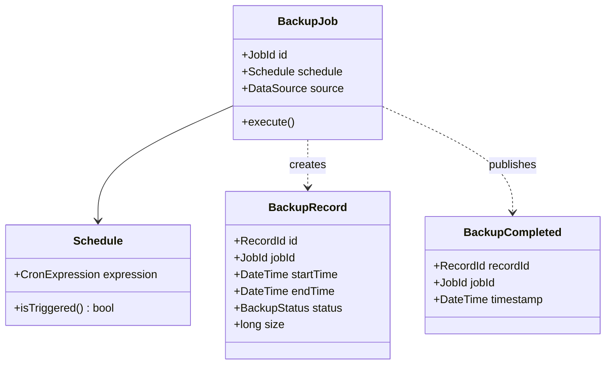

# BDD-DDD-TDD 開發流程 Skill

## 概述

此 Skill 提供一個結構化的方法，從 BDD (Behavior-Driven Development) 規格開始，推導出 DDD (Domain-Driven Design) 領域模型，並透過 TDD (Test-Driven Development) 實踐來實現功能。

## 整體開發流程



## 使用指南

### 何時使用此 Skill

- 當需要從需求規格開始建構新服務時
- 當需要重構現有服務並確保行為一致性時
- 當需要建立可維護、可測試的基礎設施工具時
- 當團隊需要統一的開發流程和文件規範時

### 核心功能

1. **BDD 規格解析**: 解析 Gherkin 語法的行為規格
2. **DDD 領域建模**: 從行為規格提取領域概念和關係
3. **TDD 實踐指引**: 提供紅-綠-重構循環的具體步驟

## 指令

### 階段一: BDD 規格定義

#### 1.1 定義用戶故事 (User Stories)

使用以下格式定義用戶故事：

```gherkin
Feature: [功能名稱]
  As a [角色]
  I want [目標]
  So that [價值]
```

#### 1.2 編寫行為規格 (Scenarios)

使用 Gherkin 語法編寫具體場景：

```gherkin
Scenario: [場景名稱]
  Given [前置條件]
  When [觸發動作]
  Then [預期結果]
```

#### 1.3 場景輪廓 (Scenario Outline)

對於參數化測試使用場景輪廓：

```gherkin
Scenario Outline: [場景名稱]
  Given [前置條件] with <參數1>
  When [動作] with <參數2>
  Then [結果] should be <預期值>

  Examples:
    | 參數1 | 參數2 | 預期值 |
    | 值1   | 值2   | 值3    |
```

### 階段二: DDD 領域建模

#### 2.1 識別限界上下文 (Bounded Context)



從 BDD 規格中識別：
- **名詞** → 可能的實體或值物件
- **動詞** → 可能的領域服務或命令
- **狀態變化** → 可能的領域事件

#### 2.2 定義聚合根 (Aggregate Root)

聚合根的特徵：
- 維護聚合內部的一致性
- 是外部存取聚合的唯一入口
- 負責協調內部物件的生命週期



#### 2.3 設計領域事件 (Domain Events)



領域事件命名規則：
- 使用過去式（如：BackupCompleted, ScheduleCreated）
- 包含事件發生的時間戳
- 包含相關的聚合根 ID

#### 2.4 定義實體與值物件

**實體 (Entity)** 特徵：
- 具有唯一識別符
- 生命週期內身份不變
- 可變狀態

**值物件 (Value Object)** 特徵：
- 無唯一識別符
- 不可變
- 通過屬性判斷相等性



### 階段三: TDD 實踐

#### 3.1 紅燈階段 (Red)



測試結構 (AAA 模式)：
```python
def test_功能描述():
    # Arrange - 準備測試資料和環境
    
    # Act - 執行被測試的動作
    
    # Assert - 驗證結果
```

#### 3.2 綠燈階段 (Green)

編寫最小程式碼使測試通過：



原則：
- 只寫剛好能通過測試的程式碼
- 不要過度設計
- 保持簡單

#### 3.3 重構階段 (Refactor)



常見重構技術：
- 提取方法 (Extract Method)
- 重新命名 (Rename)
- 提取類別 (Extract Class)
- 移動方法 (Move Method)

## 輸出文件規範

### DDD 設計文件格式

```markdown
# [服務名稱] 領域設計文件

## 1. 限界上下文圖

[Mermaid 圖表]

## 2. 聚合設計

### 2.1 [聚合名稱]

- **聚合根**: [名稱]
- **實體**: [列表]
- **值物件**: [列表]
- **不變量**: [業務規則]

## 3. 領域事件

| 事件名稱 | 觸發條件 | 包含資料 |
|---------|---------|---------|
| ...     | ...     | ...     |

## 4. 領域服務

[服務定義]
```

### TDD 測試文件格式

```markdown
# [服務名稱] 測試設計文件

## 1. 測試策略

[測試金字塔說明]

## 2. 單元測試

### 2.1 [模組名稱]

| 測試案例 | 輸入 | 預期輸出 | 狀態 |
|---------|------|---------|------|
| ...     | ...  | ...     | ⬜/✅/❌ |

## 3. 整合測試

[整合測試設計]

## 4. 測試覆蓋率目標

- 單元測試: >= 80%
- 整合測試: >= 60%
```

## 範例

### 範例: 備份服務的完整流程

**輸入: BDD 規格**

```gherkin
Feature: 資料備份管理
  As a 系統管理員
  I want 自動備份資料
  So that 可以在資料遺失時恢復

  Scenario: 執行排程備份
    Given 已配置備份排程為每日凌晨 2 點
    And 資料來源連線正常
    When 到達排程時間
    Then 應該開始執行備份
    And 備份完成後應該記錄備份資訊
    And 備份完成後應該通知管理員
```

**輸出: DDD 設計摘要**



**輸出: TDD 測試案例**

```python
class TestBackupJob:
    def test_should_trigger_backup_at_scheduled_time(self):
        # Arrange
        schedule = Schedule("0 2 * * *")  # 每日凌晨 2 點
        job = BackupJob(schedule=schedule)
        
        # Act
        should_run = job.should_execute_at(datetime(2024, 1, 1, 2, 0))
        
        # Assert
        assert should_run is True

    def test_should_not_trigger_before_scheduled_time(self):
        # Arrange
        schedule = Schedule("0 2 * * *")
        job = BackupJob(schedule=schedule)
        
        # Act
        should_run = job.should_execute_at(datetime(2024, 1, 1, 1, 59))
        
        # Assert
        assert should_run is False

    def test_should_create_backup_record_after_completion(self):
        # Arrange
        job = BackupJob(...)
        
        # Act
        record = job.execute()
        
        # Assert
        assert record is not None
        assert record.status == BackupStatus.COMPLETED
```

## 規範與限制

### 應該做的 (DO)

- ✓ 從 BDD 規格開始，逐步推導設計
- ✓ 使用通用語言（Ubiquitous Language）命名所有概念
- ✓ 每個聚合保持單一責任
- ✓ 先寫測試，再寫實現
- ✓ 每次重構後確保所有測試通過
- ✓ 使用 Mermaid 圖表視覺化設計
- ✓ 保持文件與程式碼同步更新

### 不應該做的 (DON'T)

- ✗ 跳過 BDD 規格直接開始編碼
- ✗ 讓聚合之間直接引用（應通過 ID）
- ✗ 在測試通過前進行重構
- ✗ 過度設計，添加未在規格中要求的功能
- ✗ 忽略領域事件的設計
- ✗ 使用技術術語替代領域語言

## 工作流程自動化

### 從 BDD 生成 DDD 文件

當收到 BDD 規格時，執行以下步驟：

1. **解析 Feature 文件**
   - 提取 Feature 名稱作為限界上下文候選
   - 提取 Scenario 作為用例分析基礎

2. **識別領域概念**
   - 從 Given/When/Then 提取名詞 → 實體/值物件候選
   - 從 When 提取動詞 → 命令候選
   - 從 Then 提取狀態變化 → 領域事件候選

3. **生成 DDD 設計文件**
   - 建立類別圖
   - 定義聚合邊界
   - 設計事件流程

### 從 DDD 生成 TDD 測試

1. **為每個聚合根生成測試**
   - 測試建構規則
   - 測試業務不變量
   - 測試命令處理

2. **為每個領域事件生成測試**
   - 測試事件發布條件
   - 測試事件處理邏輯

3. **為每個領域服務生成測試**
   - 測試服務協調邏輯
   - 測試異常處理

## 更新日誌

### v1.0.0
- 初始版本
- 完整的 BDD-DDD-TDD 流程定義
- 包含 Mermaid 圖表說明
- 提供備份服務範例
