# Redis Backup Service - 領域驅動設計文件

> 此文件根據 BDD 規格使用 [BDD-DDD-TDD SKILL](../../skills/skills/bdd-ddd-tdd/SKILL.md) 方法論生成

---

## 1. 限界上下文 (Bounded Contexts)

根據 BDD 規格分析，Redis Backup Service 包含以下限界上下文：

```mermaid
graph TB
    subgraph BackupContext["🗄️ 備份上下文 (Backup Context)"]
        BC1[BackupJob]
        BC2[BackupRecord]
        BC3[Schedule]
    end
    
    subgraph RestoreContext["🔄 還原上下文 (Restore Context)"]
        RC1[RestoreJob]
        RC2[RestoreRecord]
        RC3[Snapshot]
    end
    
    subgraph RetentionContext["🧹 保留策略上下文 (Retention Context)"]
        RTC1[RetentionPolicy]
        RTC2[CleanupJob]
    end
    
    subgraph MonitoringContext["📊 監控上下文 (Monitoring Context)"]
        MC1[HealthCheck]
        MC2[Metrics]
    end
    
    subgraph NotificationContext["🔔 通知上下文 (Notification Context)"]
        NC1[NotificationChannel]
        NC2[Alert]
    end
    
    BackupContext -->|發布事件| NotificationContext
    RestoreContext -->|發布事件| NotificationContext
    RetentionContext -->|清理備份| BackupContext
    MonitoringContext -->|收集指標| BackupContext
    MonitoringContext -->|收集指標| RestoreContext
```

---

## 2. 核心領域模型

### 2.1 備份上下文 (Backup Context)

#### 聚合根: BackupJob

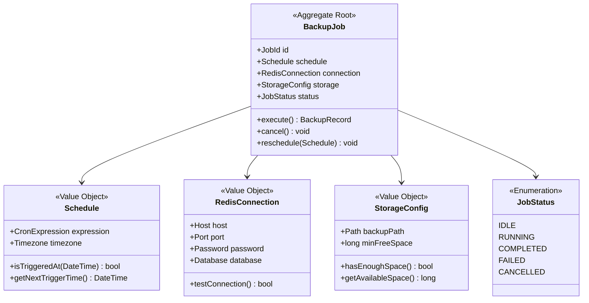

#### 實體: BackupRecord

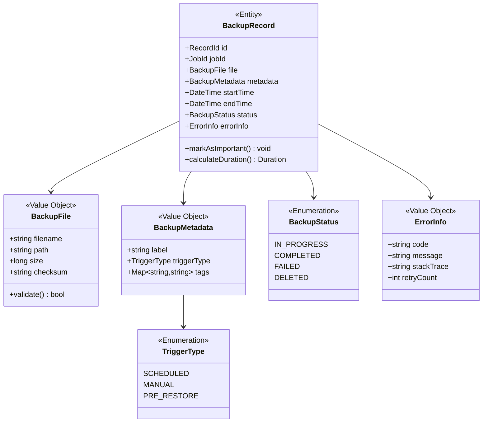

### 2.2 還原上下文 (Restore Context)

#### 聚合根: RestoreJob

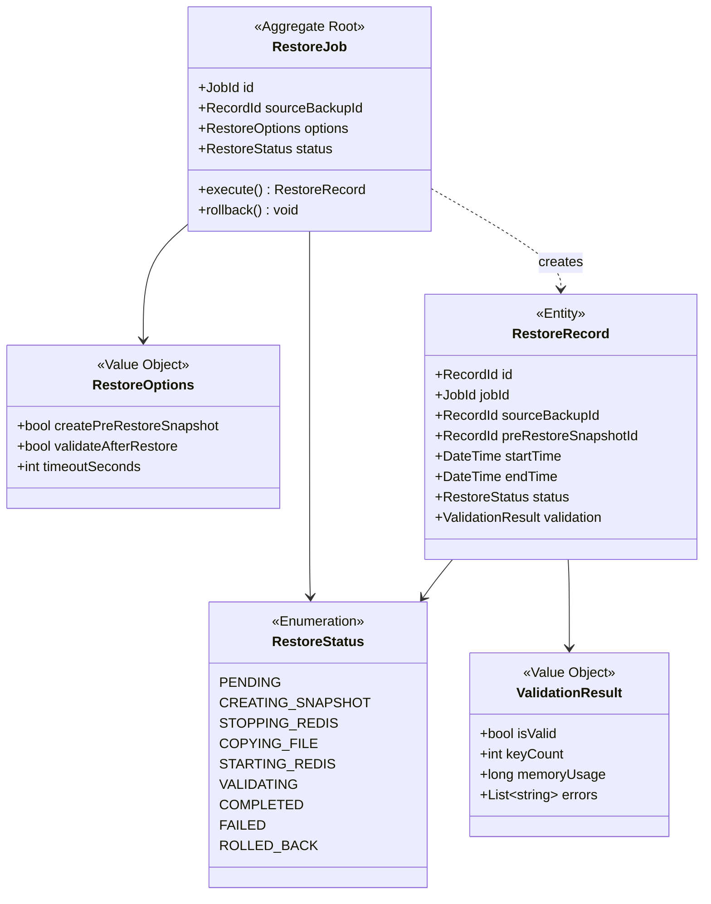

### 2.3 保留策略上下文 (Retention Context)

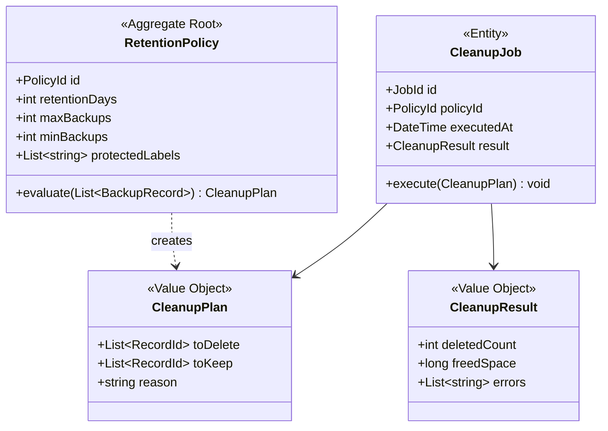

### 2.4 監控上下文 (Monitoring Context)

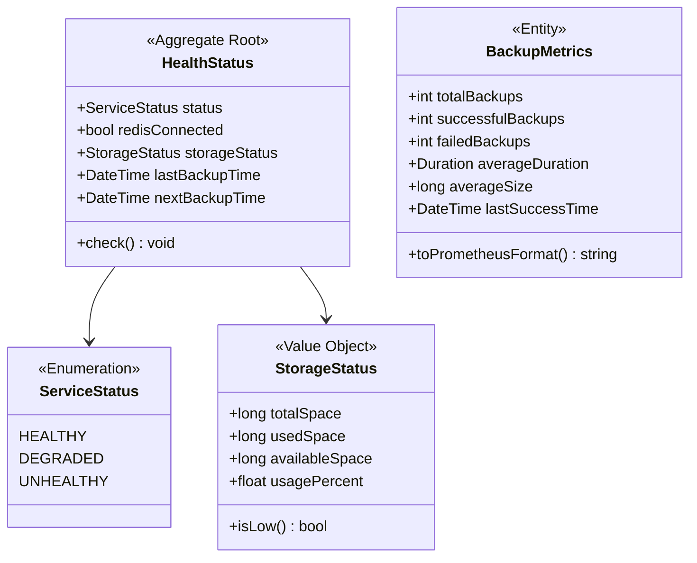

### 2.5 通知上下文 (Notification Context)

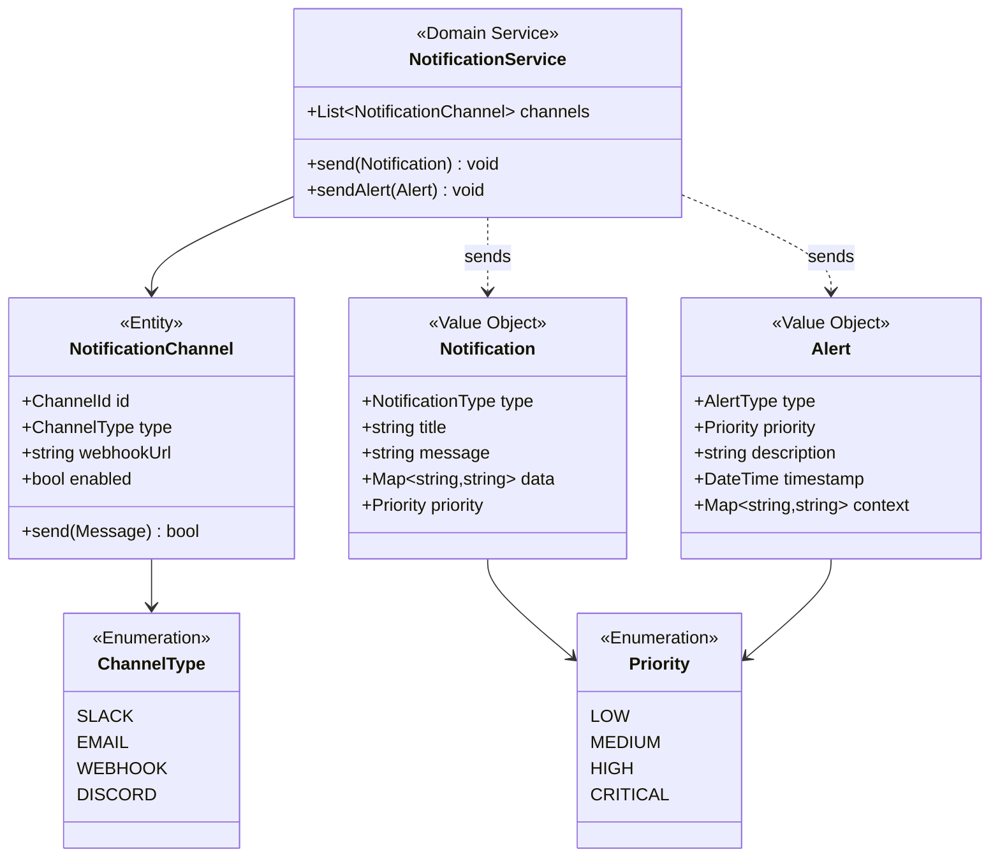

---

## 3. 領域事件 (Domain Events)

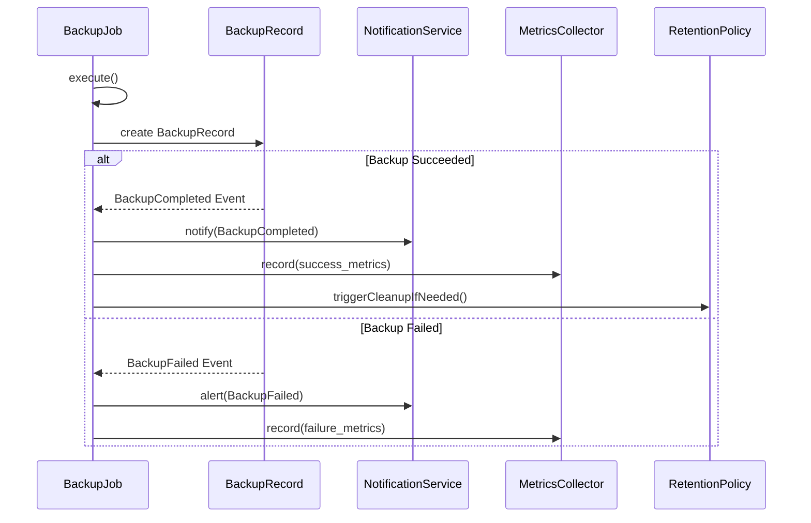

### 事件清單

| 事件名稱 | 觸發條件 | 包含資料 | 訂閱者 |
|---------|---------|---------|--------|
| `BackupStarted` | 備份任務開始執行 | jobId, startTime, triggerType | MetricsCollector |
| `BackupCompleted` | 備份成功完成 | recordId, jobId, file, duration, size | NotificationService, MetricsCollector, RetentionPolicy |
| `BackupFailed` | 備份失敗 | jobId, errorInfo, retryCount | NotificationService, MetricsCollector |
| `RestoreStarted` | 還原任務開始 | jobId, sourceBackupId | MetricsCollector |
| `RestoreCompleted` | 還原成功完成 | recordId, duration, validationResult | NotificationService |
| `RestoreFailed` | 還原失敗 | jobId, errorInfo, rollbackStatus | NotificationService |
| `CleanupExecuted` | 清理任務執行完成 | deletedCount, freedSpace | MetricsCollector |
| `StorageSpaceLow` | 儲存空間低於閾值 | availableSpace, usagePercent | NotificationService |
| `RedisConnectionLost` | Redis 連線中斷 | lastConnectedTime, errorMessage | NotificationService, HealthCheck |

---

## 4. 領域服務 (Domain Services)

### 4.1 BackupExecutionService

```mermaid
flowchart TB
    subgraph BackupExecutionService
        A[checkPreconditions] --> B{條件滿足?}
        B -->|是| C[triggerBGSAVE]
        B -->|否| D[拋出異常]
        C --> E[waitForRDBComplete]
        E --> F[copyToBackupPath]
        F --> G[calculateChecksum]
        G --> H[createBackupRecord]
        H --> I[publishEvent]
    end
```

**職責:**
- 協調備份流程
- 處理 Redis BGSAVE 命令
- 管理備份檔案的複製和驗證

### 4.2 RestoreExecutionService

```mermaid
flowchart TB
    subgraph RestoreExecutionService
        A[validateBackupFile] --> B[createPreRestoreSnapshot]
        B --> C[stopRedis]
        C --> D[replaceRDBFile]
        D --> E[startRedis]
        E --> F{驗證成功?}
        F -->|是| G[createRestoreRecord]
        F -->|否| H[rollback]
        H --> I[restoreFromSnapshot]
        I --> J[startRedis]
    end
```

**職責:**
- 協調還原流程
- 管理 Redis 服務的停止和啟動
- 處理還原失敗時的回滾

### 4.3 RetentionEnforcementService

**職責:**
- 評估備份的保留狀態
- 執行清理計劃
- 確保最小備份數量

---

## 5. 倉儲介面 (Repository Interfaces)

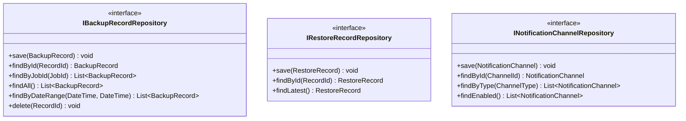

---

## 6. 應用服務 (Application Services)

### API 端點對應

| HTTP Method | Endpoint | Application Service Method |
|------------|----------|---------------------------|
| POST | `/api/v1/backup/trigger` | `BackupApplicationService.triggerManualBackup()` |
| GET | `/api/v1/backup/status/{id}` | `BackupApplicationService.getBackupStatus()` |
| GET | `/api/v1/backups` | `BackupApplicationService.listBackups()` |
| POST | `/api/v1/restore` | `RestoreApplicationService.restore()` |
| GET | `/health` | `HealthApplicationService.checkHealth()` |
| GET | `/metrics` | `MetricsApplicationService.getMetrics()` |

---

## 7. 基礎設施層 (Infrastructure Layer)

```mermaid
graph TB
    subgraph Infrastructure
        subgraph Storage
            FS[FileSystem Adapter]
            S3[S3 Adapter - 可選]
        end
        
        subgraph Redis
            RC[Redis Client]
        end
        
        subgraph Notification
            SL[Slack Client]
            EM[Email Client]
            WH[Webhook Client]
        end
        
        subgraph Scheduling
            CR[Cron Scheduler]
        end
        
        subgraph Persistence
            DB[SQLite/PostgreSQL]
        end
    end
    
    subgraph Domain
        BS[BackupService]
        RS[RestoreService]
        NS[NotificationService]
    end
    
    BS --> FS
    BS --> RC
    RS --> FS
    RS --> RC
    NS --> SL
    NS --> EM
    NS --> WH
```

---

## 8. 通用語言詞彙表 (Ubiquitous Language)

| 術語 | 定義 | 英文 |
|-----|------|------|
| 備份任務 | 執行 Redis 資料備份的工作單元 | Backup Job |
| 備份記錄 | 完成的備份操作的詳細資訊 | Backup Record |
| 排程 | 定義備份執行時間的 Cron 表達式 | Schedule |
| 還原任務 | 從備份檔案恢復資料的工作單元 | Restore Job |
| 快照 | 還原前創建的當前狀態備份 | Snapshot |
| 保留策略 | 決定備份保留和清理的規則 | Retention Policy |
| 清理任務 | 刪除過期備份的操作 | Cleanup Job |
| 健康檢查 | 驗證服務運行狀態的操作 | Health Check |
| 通知頻道 | 發送通知的目標渠道 | Notification Channel |
| 告警 | 需要立即關注的重要通知 | Alert |

---

## 9. 聚合不變量 (Aggregate Invariants)

### BackupJob 聚合

1. **單一執行**: 同一時間只能有一個備份任務在執行
2. **有效排程**: Schedule 的 Cron 表達式必須是有效格式
3. **連線驗證**: 執行備份前必須驗證 Redis 連線

### BackupRecord 聚合

1. **不可變完成狀態**: 一旦狀態變為 COMPLETED 或 FAILED，不可再變更
2. **必要校驗碼**: 成功的備份記錄必須包含有效的檔案校驗碼
3. **時間順序**: endTime 必須大於等於 startTime

### RetentionPolicy 聚合

1. **最小保留**: minBackups 必須大於 0
2. **合理範圍**: minBackups <= maxBackups
3. **保護標籤**: protectedLabels 中的備份不會被自動清理
