# Redis Backup Service - 領域驅動設計文件

> 此文件根據 BDD 規格使用 [BDD-DDD-TDD SKILL](../../skills/skills/bdd-ddd-tdd/SKILL.md) 方法論生成

---

## 1. 限界上下文 (Bounded Contexts)

根據 BDD 規格分析，Redis Backup Service 包含以下限界上下文：

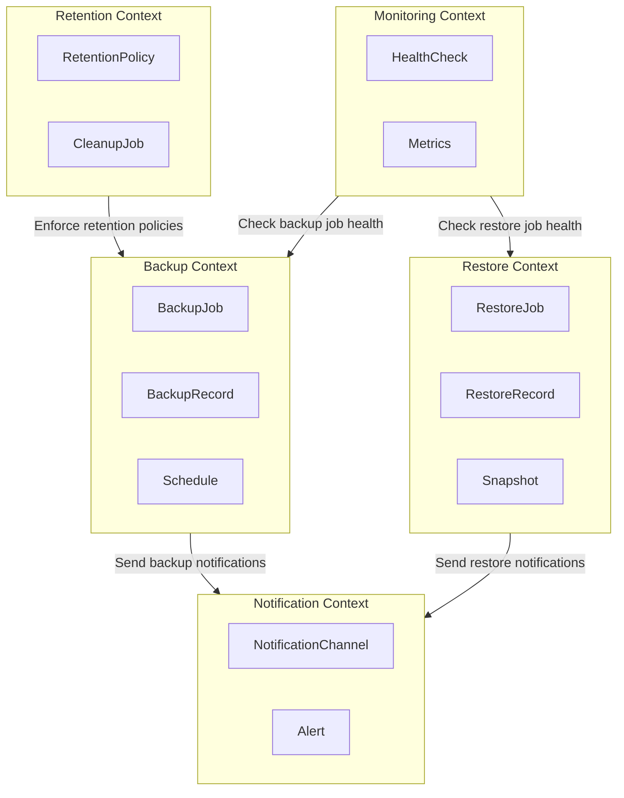

---

## 2. 核心領域模型

### 2.1 備份上下文 (Backup Context)

#### 聚合根: BackupJob

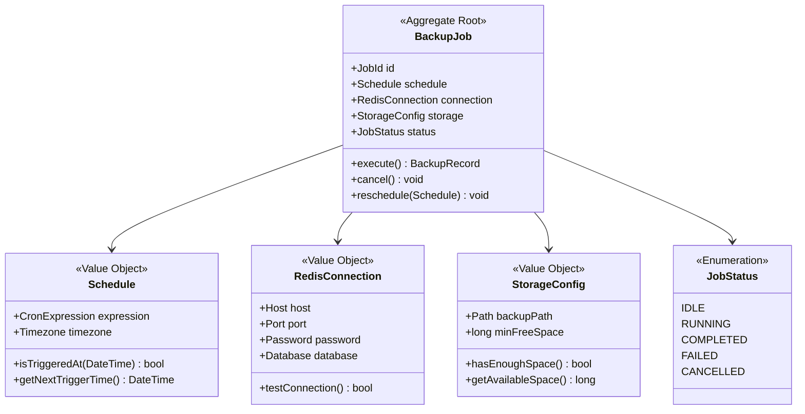

#### 實體: BackupRecord

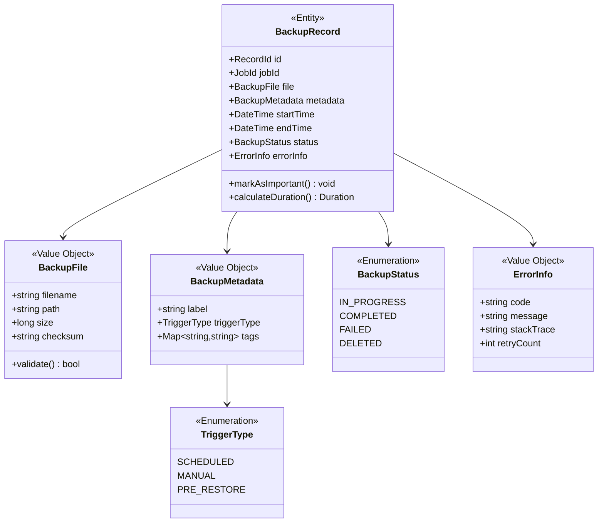

### 2.2 還原上下文 (Restore Context)

#### 聚合根: RestoreJob

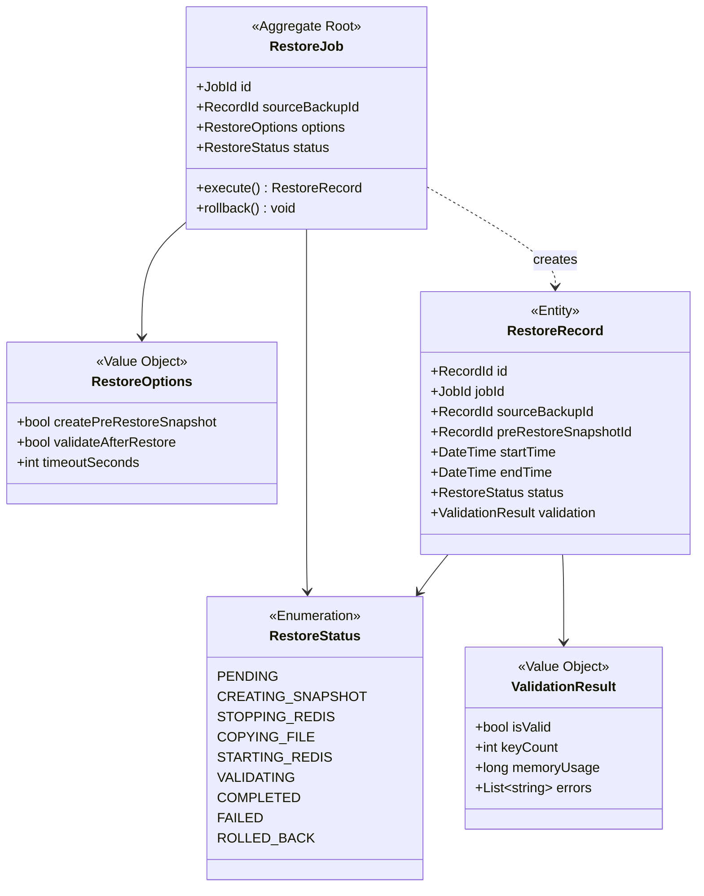

### 2.3 保留策略上下文 (Retention Context)

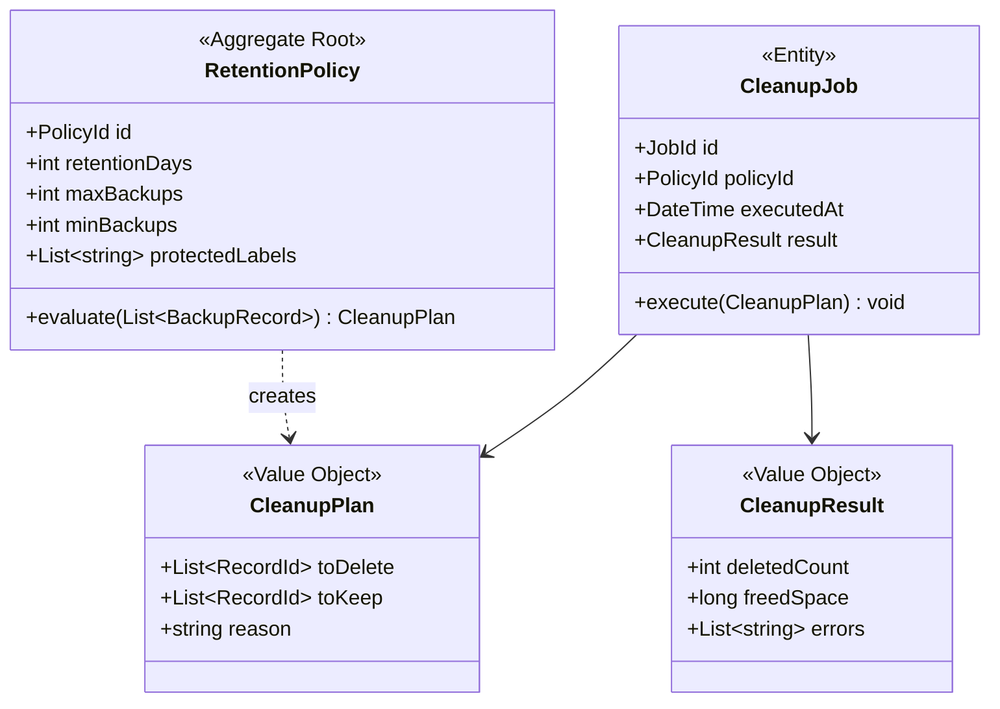

### 2.4 監控上下文 (Monitoring Context)

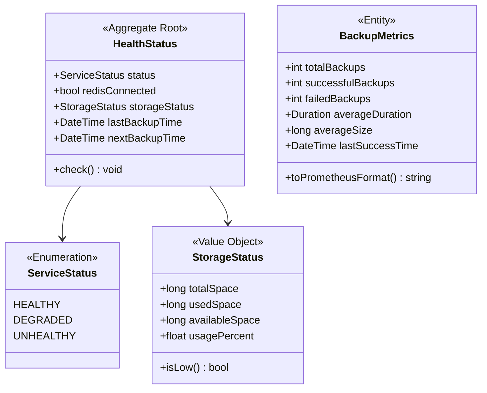

### 2.5 通知上下文 (Notification Context)

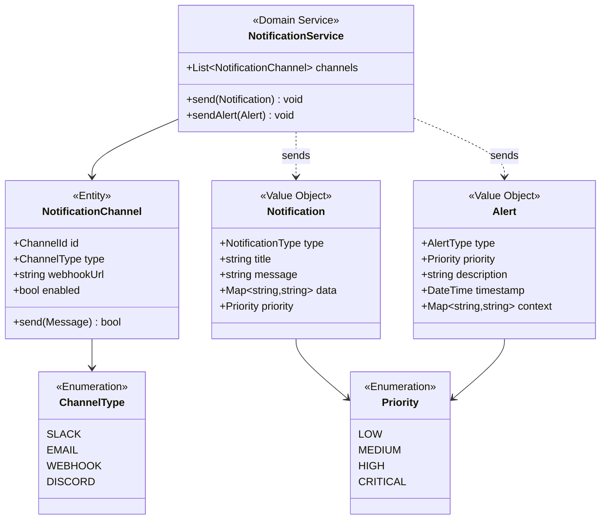

---

## 3. 領域事件 (Domain Events)

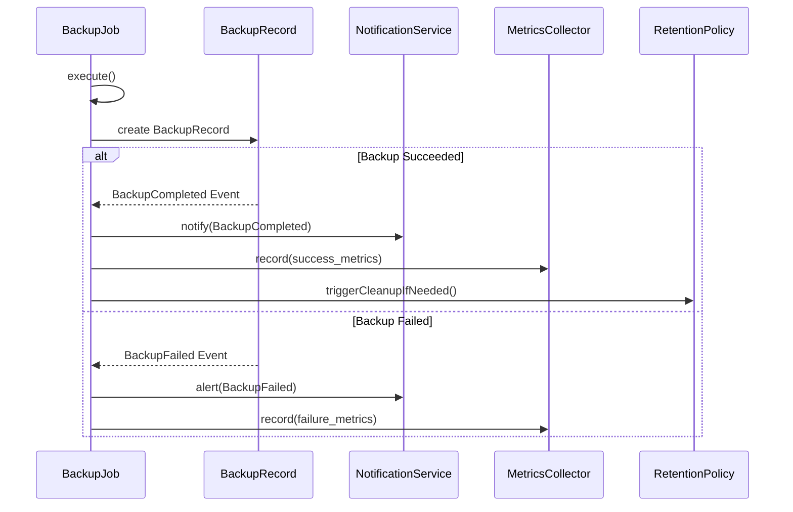

### 事件清單

| 事件名稱 | 觸發條件 | 包含資料 | 訂閱者 |
|---------|---------|---------|--------|
| `BackupStarted` | 備份任務開始執行 | jobId, startTime, triggerType | MetricsCollector |
| `BackupCompleted` | 備份成功完成 | recordId, jobId, file, duration, size | NotificationService, MetricsCollector, RetentionPolicy |
| `BackupFailed` | 備份失敗 | jobId, errorInfo, retryCount | NotificationService, MetricsCollector |
| `RestoreStarted` | 還原任務開始 | jobId, sourceBackupId | MetricsCollector |
| `RestoreCompleted` | 還原成功完成 | recordId, duration, validationResult | NotificationService |
| `RestoreFailed` | 還原失敗 | jobId, errorInfo, rollbackStatus | NotificationService |
| `CleanupExecuted` | 清理任務執行完成 | deletedCount, freedSpace | MetricsCollector |
| `StorageSpaceLow` | 儲存空間低於閾值 | availableSpace, usagePercent | NotificationService |
| `RedisConnectionLost` | Redis 連線中斷 | lastConnectedTime, errorMessage | NotificationService, HealthCheck |

---

## 4. 領域服務 (Domain Services)

### 4.1 BackupExecutionService

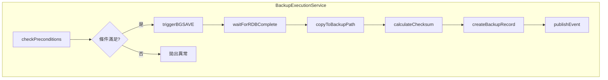

**職責:**
- 協調備份流程
- 處理 Redis BGSAVE 命令
- 管理備份檔案的複製和驗證

### 4.2 RestoreExecutionService

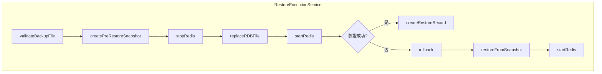

**職責:**
- 協調還原流程
- 管理 Redis 服務的停止和啟動
- 處理還原失敗時的回滾

### 4.3 RetentionEnforcementService

**職責:**
- 評估備份的保留狀態
- 執行清理計劃
- 確保最小備份數量

---

## 5. 倉儲介面 (Repository Interfaces)

---

## 6. 應用服務 (Application Services)

### API 端點對應

| HTTP Method | Endpoint | Application Service Method |
|------------|----------|---------------------------|
| POST | `/api/v1/backup/trigger` | `BackupApplicationService.triggerManualBackup()` |
| GET | `/api/v1/backup/status/{id}` | `BackupApplicationService.getBackupStatus()` |
| GET | `/api/v1/backups` | `BackupApplicationService.listBackups()` |
| POST | `/api/v1/restore` | `RestoreApplicationService.restore()` |
| GET | `/health` | `HealthApplicationService.checkHealth()` |
| GET | `/metrics` | `MetricsApplicationService.getMetrics()` |

---

## 7. 基礎設施層 (Infrastructure Layer)

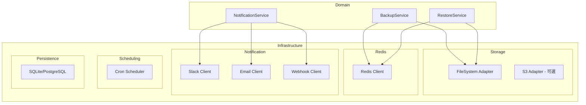

---

## 8. 通用語言詞彙表 (Ubiquitous Language)

| 術語 | 定義 | 英文 |
|-----|------|------|
| 備份任務 | 執行 Redis 資料備份的工作單元 | Backup Job |
| 備份記錄 | 完成的備份操作的詳細資訊 | Backup Record |
| 排程 | 定義備份執行時間的 Cron 表達式 | Schedule |
| 還原任務 | 從備份檔案恢復資料的工作單元 | Restore Job |
| 快照 | 還原前創建的當前狀態備份 | Snapshot |
| 保留策略 | 決定備份保留和清理的規則 | Retention Policy |
| 清理任務 | 刪除過期備份的操作 | Cleanup Job |
| 健康檢查 | 驗證服務運行狀態的操作 | Health Check |
| 通知頻道 | 發送通知的目標渠道 | Notification Channel |
| 告警 | 需要立即關注的重要通知 | Alert |

---

## 9. 聚合不變量 (Aggregate Invariants)

### BackupJob 聚合

1. **單一執行**: 同一時間只能有一個備份任務在執行
2. **有效排程**: Schedule 的 Cron 表達式必須是有效格式
3. **連線驗證**: 執行備份前必須驗證 Redis 連線

### BackupRecord 聚合

1. **不可變完成狀態**: 一旦狀態變為 COMPLETED 或 FAILED，不可再變更
2. **必要校驗碼**: 成功的備份記錄必須包含有效的檔案校驗碼
3. **時間順序**: endTime 必須大於等於 startTime

### RetentionPolicy 聚合

1. **最小保留**: minBackups 必須大於 0
2. **合理範圍**: minBackups <= maxBackups
3. **保護標籤**: protectedLabels 中的備份不會被自動清理
