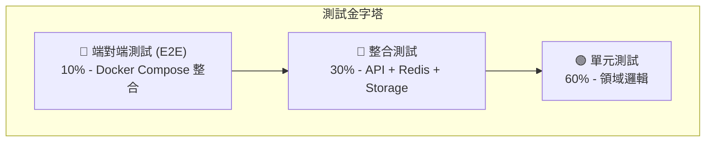

# Redis Backup Service - TDD 測試設計文件

> 此文件根據 DDD 設計使用 [BDD-DDD-TDD SKILL](../../skills/skills/bdd-ddd-tdd/SKILL.md) 方法論生成

---

## 1. 測試策略

### 測試金字塔



### 測試覆蓋率目標

| 層級 | 目標覆蓋率 | 說明 |
|-----|-----------|------|
| 領域層 (Domain) | >= 90% | 業務邏輯核心 |
| 應用層 (Application) | >= 80% | 用例協調 |
| 基礎設施層 (Infrastructure) | >= 60% | 外部整合 |
| API 層 | >= 70% | 端點處理 |

---

## 2. 單元測試設計

### 2.1 值物件測試 (Value Objects)

#### Schedule 值物件

```python
# tests/unit/domain/test_schedule.py

class TestSchedule:
    """Schedule 值物件測試"""
    
    # --- 建構測試 ---
    
    def test_should_create_schedule_with_valid_cron_expression(self):
        """應該使用有效的 Cron 表達式建立 Schedule"""
        # Arrange
        cron_expr = "0 2 * * *"
        
        # Act
        schedule = Schedule(expression=cron_expr)
        
        # Assert
        assert schedule.expression == cron_expr
    
    def test_should_reject_invalid_cron_expression(self):
        """應該拒絕無效的 Cron 表達式"""
        # Arrange
        invalid_expr = "invalid"
        
        # Act & Assert
        with pytest.raises(InvalidCronExpressionError):
            Schedule(expression=invalid_expr)
    
    # --- 行為測試 ---
    
    def test_should_return_true_when_time_matches_schedule(self):
        """當時間符合排程時應該返回 True"""
        # Arrange
        schedule = Schedule(expression="0 2 * * *")  # 每日凌晨 2 點
        check_time = datetime(2024, 1, 1, 2, 0, 0)
        
        # Act
        result = schedule.is_triggered_at(check_time)
        
        # Assert
        assert result is True
    
    def test_should_return_false_when_time_not_matches(self):
        """當時間不符合排程時應該返回 False"""
        # Arrange
        schedule = Schedule(expression="0 2 * * *")
        check_time = datetime(2024, 1, 1, 3, 0, 0)
        
        # Act
        result = schedule.is_triggered_at(check_time)
        
        # Assert
        assert result is False
    
    def test_should_calculate_next_trigger_time(self):
        """應該計算下一次觸發時間"""
        # Arrange
        schedule = Schedule(expression="0 2 * * *")
        current_time = datetime(2024, 1, 1, 10, 0, 0)
        
        # Act
        next_time = schedule.get_next_trigger_time(after=current_time)
        
        # Assert
        assert next_time == datetime(2024, 1, 2, 2, 0, 0)
```

#### RedisConnection 值物件

```python
# tests/unit/domain/test_redis_connection.py

class TestRedisConnection:
    """RedisConnection 值物件測試"""
    
    def test_should_create_connection_with_valid_config(self):
        """應該使用有效配置建立連線"""
        # Arrange & Act
        conn = RedisConnection(
            host="localhost",
            port=6379,
            password="secret",
            database=0
        )
        
        # Assert
        assert conn.host == "localhost"
        assert conn.port == 6379
    
    def test_should_reject_invalid_port(self):
        """應該拒絕無效的 port"""
        # Act & Assert
        with pytest.raises(InvalidPortError):
            RedisConnection(host="localhost", port=-1)
    
    def test_should_create_connection_string(self):
        """應該生成正確的連線字串"""
        # Arrange
        conn = RedisConnection(host="localhost", port=6379, database=0)
        
        # Act
        conn_str = conn.to_connection_string()
        
        # Assert
        assert conn_str == "redis://localhost:6379/0"
```

#### BackupFile 值物件

```python
# tests/unit/domain/test_backup_file.py

class TestBackupFile:
    """BackupFile 值物件測試"""
    
    def test_should_generate_filename_with_timestamp(self):
        """應該生成帶時間戳的檔案名稱"""
        # Arrange
        timestamp = datetime(2024, 1, 15, 2, 30, 45)
        
        # Act
        file = BackupFile.create(timestamp=timestamp)
        
        # Assert
        assert file.filename == "redis_backup_20240115_023045.rdb"
    
    def test_should_include_label_in_filename(self):
        """應該在檔案名稱中包含標籤"""
        # Arrange
        timestamp = datetime(2024, 1, 15, 2, 30, 45)
        label = "pre-migration"
        
        # Act
        file = BackupFile.create(timestamp=timestamp, label=label)
        
        # Assert
        assert file.filename == "redis_backup_20240115_023045_pre-migration.rdb"
    
    def test_should_validate_checksum(self):
        """應該驗證校驗碼"""
        # Arrange
        file = BackupFile(
            filename="test.rdb",
            path="/backups/test.rdb",
            size=1024,
            checksum="abc123"
        )
        
        # Act
        is_valid = file.validate_checksum("abc123")
        
        # Assert
        assert is_valid is True
```

### 2.2 實體測試 (Entities)

#### BackupRecord 實體

```python
# tests/unit/domain/test_backup_record.py

class TestBackupRecord:
    """BackupRecord 實體測試"""
    
    def test_should_create_record_with_in_progress_status(self):
        """建立時應該是 IN_PROGRESS 狀態"""
        # Arrange & Act
        record = BackupRecord.create(
            job_id=JobId("job-1"),
            trigger_type=TriggerType.SCHEDULED
        )
        
        # Assert
        assert record.status == BackupStatus.IN_PROGRESS
        assert record.start_time is not None
    
    def test_should_complete_record_with_file_info(self):
        """完成時應該包含檔案資訊"""
        # Arrange
        record = BackupRecord.create(job_id=JobId("job-1"))
        file = BackupFile(
            filename="backup.rdb",
            path="/backups/backup.rdb",
            size=1024,
            checksum="abc123"
        )
        
        # Act
        record.complete(file=file)
        
        # Assert
        assert record.status == BackupStatus.COMPLETED
        assert record.file == file
        assert record.end_time is not None
    
    def test_should_fail_record_with_error_info(self):
        """失敗時應該包含錯誤資訊"""
        # Arrange
        record = BackupRecord.create(job_id=JobId("job-1"))
        error = ErrorInfo(
            code="REDIS_CONNECTION_ERROR",
            message="Cannot connect to Redis"
        )
        
        # Act
        record.fail(error=error)
        
        # Assert
        assert record.status == BackupStatus.FAILED
        assert record.error_info == error
    
    def test_should_not_change_completed_status(self):
        """已完成的記錄不應該再變更狀態"""
        # Arrange
        record = BackupRecord.create(job_id=JobId("job-1"))
        record.complete(file=create_mock_file())
        
        # Act & Assert
        with pytest.raises(InvalidStateTransitionError):
            record.fail(error=ErrorInfo(code="ERROR", message="error"))
    
    def test_should_calculate_duration(self):
        """應該計算備份持續時間"""
        # Arrange
        record = BackupRecord.create(job_id=JobId("job-1"))
        record._start_time = datetime(2024, 1, 1, 2, 0, 0)
        record._end_time = datetime(2024, 1, 1, 2, 5, 30)
        
        # Act
        duration = record.calculate_duration()
        
        # Assert
        assert duration == timedelta(minutes=5, seconds=30)
    
    def test_should_mark_as_important(self):
        """應該標記為重要"""
        # Arrange
        record = BackupRecord.create(job_id=JobId("job-1"))
        record.complete(file=create_mock_file())
        
        # Act
        record.mark_as_important()
        
        # Assert
        assert record.metadata.is_important is True
```

### 2.3 聚合根測試 (Aggregate Roots)

#### BackupJob 聚合根

```python
# tests/unit/domain/test_backup_job.py

class TestBackupJob:
    """BackupJob 聚合根測試"""
    
    # --- 建構測試 ---
    
    def test_should_create_job_with_idle_status(self):
        """建立時應該是 IDLE 狀態"""
        # Arrange & Act
        job = BackupJob.create(
            schedule=Schedule("0 2 * * *"),
            connection=create_mock_connection(),
            storage=create_mock_storage()
        )
        
        # Assert
        assert job.status == JobStatus.IDLE
    
    # --- 執行測試 ---
    
    def test_should_execute_when_conditions_met(self):
        """條件滿足時應該執行備份"""
        # Arrange
        job = BackupJob.create(
            schedule=Schedule("0 2 * * *"),
            connection=create_connected_mock(),
            storage=create_storage_with_space()
        )
        
        # Act
        record = job.execute()
        
        # Assert
        assert job.status == JobStatus.RUNNING
        assert record is not None
    
    def test_should_not_execute_when_already_running(self):
        """已在執行時不應該再次執行"""
        # Arrange
        job = BackupJob.create(...)
        job._status = JobStatus.RUNNING
        
        # Act & Assert
        with pytest.raises(JobAlreadyRunningError):
            job.execute()
    
    def test_should_not_execute_when_redis_disconnected(self):
        """Redis 斷線時不應該執行"""
        # Arrange
        disconnected = create_disconnected_mock()
        job = BackupJob.create(connection=disconnected, ...)
        
        # Act & Assert
        with pytest.raises(RedisConnectionError):
            job.execute()
    
    def test_should_not_execute_when_storage_full(self):
        """儲存空間不足時不應該執行"""
        # Arrange
        full_storage = create_storage_without_space()
        job = BackupJob.create(storage=full_storage, ...)
        
        # Act & Assert
        with pytest.raises(InsufficientStorageError):
            job.execute()
    
    # --- 排程測試 ---
    
    def test_should_trigger_at_scheduled_time(self):
        """應該在排程時間觸發"""
        # Arrange
        job = BackupJob.create(schedule=Schedule("0 2 * * *"), ...)
        check_time = datetime(2024, 1, 1, 2, 0, 0)
        
        # Act
        should_run = job.should_execute_at(check_time)
        
        # Assert
        assert should_run is True
    
    def test_should_reschedule(self):
        """應該可以重新設定排程"""
        # Arrange
        job = BackupJob.create(schedule=Schedule("0 2 * * *"), ...)
        new_schedule = Schedule("0 */6 * * *")
        
        # Act
        job.reschedule(new_schedule)
        
        # Assert
        assert job.schedule == new_schedule
```

#### RetentionPolicy 聚合根

```python
# tests/unit/domain/test_retention_policy.py

class TestRetentionPolicy:
    """RetentionPolicy 聚合根測試"""
    
    def test_should_create_policy_with_valid_config(self):
        """應該使用有效配置建立策略"""
        # Arrange & Act
        policy = RetentionPolicy.create(
            retention_days=7,
            max_backups=30,
            min_backups=3
        )
        
        # Assert
        assert policy.retention_days == 7
        assert policy.max_backups == 30
        assert policy.min_backups == 3
    
    def test_should_reject_min_backups_greater_than_max(self):
        """min_backups 不應該大於 max_backups"""
        # Act & Assert
        with pytest.raises(InvalidPolicyError):
            RetentionPolicy.create(
                retention_days=7,
                max_backups=3,
                min_backups=5
            )
    
    def test_should_identify_expired_backups(self):
        """應該識別過期備份"""
        # Arrange
        policy = RetentionPolicy.create(retention_days=7, ...)
        now = datetime(2024, 1, 15)
        
        backups = [
            create_backup_record(created_at=datetime(2024, 1, 1)),   # 過期
            create_backup_record(created_at=datetime(2024, 1, 5)),   # 過期
            create_backup_record(created_at=datetime(2024, 1, 10)),  # 有效
            create_backup_record(created_at=datetime(2024, 1, 14)),  # 有效
        ]
        
        # Act
        plan = policy.evaluate(backups, current_time=now)
        
        # Assert
        assert len(plan.to_delete) == 2
        assert len(plan.to_keep) == 2
    
    def test_should_keep_minimum_backups(self):
        """應該保留最少數量的備份"""
        # Arrange
        policy = RetentionPolicy.create(
            retention_days=7,
            min_backups=3
        )
        now = datetime(2024, 1, 15)
        
        # 所有備份都過期，但只有 3 個
        backups = [
            create_backup_record(created_at=datetime(2024, 1, 1)),
            create_backup_record(created_at=datetime(2024, 1, 2)),
            create_backup_record(created_at=datetime(2024, 1, 3)),
        ]
        
        # Act
        plan = policy.evaluate(backups, current_time=now)
        
        # Assert
        assert len(plan.to_delete) == 0  # 不刪除任何備份
        assert len(plan.to_keep) == 3
    
    def test_should_delete_oldest_when_exceeds_max(self):
        """超過最大數量時應該刪除最舊的"""
        # Arrange
        policy = RetentionPolicy.create(max_backups=3, ...)
        
        backups = [
            create_backup_record(created_at=datetime(2024, 1, 1)),  # 最舊 - 刪除
            create_backup_record(created_at=datetime(2024, 1, 2)),  # 刪除
            create_backup_record(created_at=datetime(2024, 1, 3)),
            create_backup_record(created_at=datetime(2024, 1, 4)),
            create_backup_record(created_at=datetime(2024, 1, 5)),  # 最新
        ]
        
        # Act
        plan = policy.evaluate(backups)
        
        # Assert
        assert len(plan.to_delete) == 2
    
    def test_should_protect_important_backups(self):
        """應該保護重要備份"""
        # Arrange
        policy = RetentionPolicy.create(
            retention_days=7,
            protected_labels=["important", "pre-migration"]
        )
        now = datetime(2024, 1, 15)
        
        important_backup = create_backup_record(
            created_at=datetime(2024, 1, 1),  # 過期
            label="pre-migration"
        )
        
        # Act
        plan = policy.evaluate([important_backup], current_time=now)
        
        # Assert
        assert len(plan.to_delete) == 0
        assert important_backup.id in [b.id for b in plan.to_keep]
```

### 2.4 領域服務測試 (Domain Services)

#### BackupExecutionService

```python
# tests/unit/domain/services/test_backup_execution_service.py

class TestBackupExecutionService:
    """BackupExecutionService 領域服務測試"""
    
    @pytest.fixture
    def service(self, mock_redis_client, mock_file_system):
        return BackupExecutionService(
            redis_client=mock_redis_client,
            file_system=mock_file_system
        )
    
    def test_should_execute_bgsave_command(self, service, mock_redis_client):
        """應該執行 BGSAVE 命令"""
        # Arrange
        mock_redis_client.bgsave.return_value = True
        
        # Act
        service.execute_backup()
        
        # Assert
        mock_redis_client.bgsave.assert_called_once()
    
    def test_should_wait_for_rdb_file_completion(self, service, mock_redis_client):
        """應該等待 RDB 檔案生成完成"""
        # Arrange
        mock_redis_client.lastsave.side_effect = [
            datetime(2024, 1, 1, 1, 0, 0),  # 舊的時間戳
            datetime(2024, 1, 1, 1, 0, 0),  # 仍是舊的
            datetime(2024, 1, 1, 2, 0, 0),  # 新的時間戳 - 完成
        ]
        
        # Act
        result = service.wait_for_backup_completion(timeout=30)
        
        # Assert
        assert result is True
        assert mock_redis_client.lastsave.call_count == 3
    
    def test_should_timeout_when_backup_takes_too_long(self, service, mock_redis_client):
        """備份時間過長時應該超時"""
        # Arrange
        mock_redis_client.lastsave.return_value = datetime(2024, 1, 1, 1, 0, 0)
        
        # Act & Assert
        with pytest.raises(BackupTimeoutError):
            service.wait_for_backup_completion(timeout=1)
    
    def test_should_copy_rdb_to_backup_path(self, service, mock_file_system):
        """應該複製 RDB 檔案到備份目錄"""
        # Arrange
        source = "/var/lib/redis/dump.rdb"
        destination = "/backups/redis_backup_20240101_020000.rdb"
        
        # Act
        service.copy_backup(source, destination)
        
        # Assert
        mock_file_system.copy.assert_called_with(source, destination)
    
    def test_should_calculate_file_checksum(self, service, mock_file_system):
        """應該計算檔案校驗碼"""
        # Arrange
        mock_file_system.calculate_md5.return_value = "abc123"
        
        # Act
        checksum = service.calculate_checksum("/backups/test.rdb")
        
        # Assert
        assert checksum == "abc123"
```

### 2.5 領域事件測試 (Domain Events)

```python
# tests/unit/domain/events/test_backup_events.py

class TestBackupEvents:
    """備份領域事件測試"""
    
    def test_backup_completed_event_should_contain_required_data(self):
        """BackupCompleted 事件應該包含必要資料"""
        # Arrange
        record = create_completed_backup_record()
        
        # Act
        event = BackupCompleted.from_record(record)
        
        # Assert
        assert event.record_id == record.id
        assert event.job_id == record.job_id
        assert event.file_name == record.file.filename
        assert event.size == record.file.size
        assert event.duration == record.calculate_duration()
        assert event.timestamp is not None
    
    def test_backup_failed_event_should_contain_error_info(self):
        """BackupFailed 事件應該包含錯誤資訊"""
        # Arrange
        job_id = JobId("job-1")
        error = ErrorInfo(code="ERROR", message="Connection failed")
        
        # Act
        event = BackupFailed(job_id=job_id, error_info=error, retry_count=2)
        
        # Assert
        assert event.job_id == job_id
        assert event.error_info == error
        assert event.retry_count == 2
```

---

## 3. 整合測試設計

### 3.1 API 整合測試

```python
# tests/integration/api/test_backup_api.py

class TestBackupAPI:
    """備份 API 整合測試"""
    
    @pytest.fixture
    def client(self, app):
        return TestClient(app)
    
    def test_trigger_backup_should_return_202(self, client, mock_backup_job):
        """觸發備份應該返回 202"""
        # Arrange
        mock_backup_job.status = JobStatus.IDLE
        
        # Act
        response = client.post("/api/v1/backup/trigger")
        
        # Assert
        assert response.status_code == 202
        assert "task_id" in response.json()
    
    def test_trigger_backup_should_return_409_when_running(self, client, mock_backup_job):
        """備份執行中時應該返回 409"""
        # Arrange
        mock_backup_job.status = JobStatus.RUNNING
        
        # Act
        response = client.post("/api/v1/backup/trigger")
        
        # Assert
        assert response.status_code == 409
    
    def test_get_backup_status_should_return_task_info(self, client):
        """取得備份狀態應該返回任務資訊"""
        # Act
        response = client.get("/api/v1/backup/status/task-123")
        
        # Assert
        assert response.status_code == 200
        data = response.json()
        assert "status" in data
        assert "start_time" in data
        assert "progress" in data
    
    def test_list_backups_should_return_all_backups(self, client, mock_repository):
        """列出備份應該返回所有備份"""
        # Arrange
        mock_repository.find_all.return_value = [
            create_backup_record(),
            create_backup_record(),
        ]
        
        # Act
        response = client.get("/api/v1/backups")
        
        # Assert
        assert response.status_code == 200
        assert len(response.json()["backups"]) == 2
```

### 3.2 Redis 整合測試

```python
# tests/integration/infrastructure/test_redis_client.py

@pytest.mark.integration
class TestRedisClientIntegration:
    """Redis 客戶端整合測試"""
    
    @pytest.fixture
    def redis_client(self, redis_container):
        return RedisClientAdapter(
            host=redis_container.host,
            port=redis_container.port
        )
    
    def test_should_connect_to_redis(self, redis_client):
        """應該連線到 Redis"""
        # Act
        is_connected = redis_client.test_connection()
        
        # Assert
        assert is_connected is True
    
    def test_should_execute_bgsave(self, redis_client):
        """應該執行 BGSAVE"""
        # Act
        result = redis_client.bgsave()
        
        # Assert
        assert result is True
    
    def test_should_get_rdb_path(self, redis_client):
        """應該取得 RDB 檔案路徑"""
        # Act
        path = redis_client.get_rdb_path()
        
        # Assert
        assert path.endswith(".rdb")
```

### 3.3 儲存整合測試

```python
# tests/integration/infrastructure/test_file_storage.py

@pytest.mark.integration
class TestFileStorageIntegration:
    """檔案儲存整合測試"""
    
    @pytest.fixture
    def storage(self, tmp_path):
        return FileStorageAdapter(backup_path=str(tmp_path))
    
    def test_should_save_backup_file(self, storage, tmp_path):
        """應該儲存備份檔案"""
        # Arrange
        source_file = tmp_path / "source.rdb"
        source_file.write_bytes(b"test content")
        
        # Act
        result = storage.save(
            source=str(source_file),
            filename="backup.rdb"
        )
        
        # Assert
        assert result.exists()
    
    def test_should_list_backups(self, storage, tmp_path):
        """應該列出備份"""
        # Arrange
        (tmp_path / "backup1.rdb").touch()
        (tmp_path / "backup2.rdb").touch()
        
        # Act
        backups = storage.list_backups()
        
        # Assert
        assert len(backups) == 2
    
    def test_should_check_available_space(self, storage):
        """應該檢查可用空間"""
        # Act
        space = storage.get_available_space()
        
        # Assert
        assert space > 0
```

---

## 4. 端對端測試設計

```python
# tests/e2e/test_backup_workflow.py

@pytest.mark.e2e
class TestBackupWorkflowE2E:
    """備份工作流程端對端測試"""
    
    @pytest.fixture(scope="class")
    def docker_compose(self):
        """啟動 Docker Compose 環境"""
        compose = DockerCompose("docker-compose.test.yml")
        compose.up()
        yield compose
        compose.down()
    
    def test_complete_backup_workflow(self, docker_compose, api_client):
        """完整備份工作流程測試"""
        # Step 1: 檢查健康狀態
        health = api_client.get("/health")
        assert health.json()["status"] == "healthy"
        
        # Step 2: 觸發備份
        trigger_response = api_client.post("/api/v1/backup/trigger")
        assert trigger_response.status_code == 202
        task_id = trigger_response.json()["task_id"]
        
        # Step 3: 等待備份完成
        for _ in range(30):
            status = api_client.get(f"/api/v1/backup/status/{task_id}")
            if status.json()["status"] == "COMPLETED":
                break
            time.sleep(1)
        
        assert status.json()["status"] == "COMPLETED"
        
        # Step 4: 確認備份檔案存在
        backups = api_client.get("/api/v1/backups")
        assert len(backups.json()["backups"]) >= 1
    
    def test_restore_from_backup(self, docker_compose, api_client):
        """從備份還原測試"""
        # Step 1: 取得備份列表
        backups = api_client.get("/api/v1/backups")
        backup_file = backups.json()["backups"][0]["filename"]
        
        # Step 2: 執行還原
        restore_response = api_client.post(
            "/api/v1/restore",
            json={"backup_file": backup_file}
        )
        assert restore_response.status_code == 200
        
        # Step 3: 驗證還原結果
        result = restore_response.json()
        assert result["status"] == "COMPLETED"
        assert result["validation"]["is_valid"] is True
```

---

## 5. 測試案例追蹤表

### 5.1 值物件測試

| 測試案例 | 目標物件 | 狀態 |
|---------|---------|------|
| 有效 Cron 表達式建立 Schedule | Schedule | ⬜ |
| 無效 Cron 表達式拒絕 | Schedule | ⬜ |
| 時間符合排程判斷 | Schedule | ⬜ |
| 計算下次觸發時間 | Schedule | ⬜ |
| 有效連線配置建立 | RedisConnection | ⬜ |
| 無效 port 拒絕 | RedisConnection | ⬜ |
| 生成帶時間戳檔名 | BackupFile | ⬜ |
| 帶標籤的檔名 | BackupFile | ⬜ |
| 校驗碼驗證 | BackupFile | ⬜ |

### 5.2 實體測試

| 測試案例 | 目標物件 | 狀態 |
|---------|---------|------|
| 建立時 IN_PROGRESS 狀態 | BackupRecord | ⬜ |
| 完成時包含檔案資訊 | BackupRecord | ⬜ |
| 失敗時包含錯誤資訊 | BackupRecord | ⬜ |
| 已完成不可再變更 | BackupRecord | ⬜ |
| 計算持續時間 | BackupRecord | ⬜ |
| 標記為重要 | BackupRecord | ⬜ |

### 5.3 聚合根測試

| 測試案例 | 目標物件 | 狀態 |
|---------|---------|------|
| 建立時 IDLE 狀態 | BackupJob | ⬜ |
| 條件滿足時執行 | BackupJob | ⬜ |
| 執行中不可再執行 | BackupJob | ⬜ |
| Redis 斷線不執行 | BackupJob | ⬜ |
| 空間不足不執行 | BackupJob | ⬜ |
| 排程時間觸發 | BackupJob | ⬜ |
| 重新設定排程 | BackupJob | ⬜ |
| 識別過期備份 | RetentionPolicy | ⬜ |
| 保留最少備份 | RetentionPolicy | ⬜ |
| 超過最大數量刪除最舊 | RetentionPolicy | ⬜ |
| 保護重要備份 | RetentionPolicy | ⬜ |

### 5.4 領域服務測試

| 測試案例 | 目標服務 | 狀態 |
|---------|---------|------|
| 執行 BGSAVE | BackupExecutionService | ⬜ |
| 等待 RDB 完成 | BackupExecutionService | ⬜ |
| 備份超時 | BackupExecutionService | ⬜ |
| 複製到備份目錄 | BackupExecutionService | ⬜ |
| 計算校驗碼 | BackupExecutionService | ⬜ |

### 5.5 整合測試

| 測試案例 | 目標 | 狀態 |
|---------|------|------|
| 觸發備份返回 202 | Backup API | ⬜ |
| 執行中返回 409 | Backup API | ⬜ |
| 取得備份狀態 | Backup API | ⬜ |
| 列出所有備份 | Backup API | ⬜ |
| 連線 Redis | Redis Client | ⬜ |
| 執行 BGSAVE | Redis Client | ⬜ |
| 儲存備份檔案 | File Storage | ⬜ |
| 列出備份 | File Storage | ⬜ |

### 5.6 端對端測試

| 測試案例 | 狀態 |
|---------|------|
| 完整備份工作流程 | ⬜ |
| 從備份還原 | ⬜ |

---

## 6. 測試執行指令

```bash
# 執行所有單元測試
pytest tests/unit -v

# 執行特定模組測試
pytest tests/unit/domain/test_backup_job.py -v

# 執行整合測試（需要 Docker）
pytest tests/integration -v -m integration

# 執行端對端測試
pytest tests/e2e -v -m e2e

# 執行測試並生成覆蓋率報告
pytest --cov=src --cov-report=html tests/

# 執行所有測試
pytest tests/ -v
```

---

## 7. Mock 與 Fixture 設計

```python
# tests/conftest.py

@pytest.fixture
def mock_redis_client():
    """Mock Redis 客戶端"""
    client = Mock(spec=IRedisClient)
    client.test_connection.return_value = True
    client.bgsave.return_value = True
    return client

@pytest.fixture
def mock_file_system():
    """Mock 檔案系統"""
    fs = Mock(spec=IFileSystem)
    fs.copy.return_value = True
    fs.get_available_space.return_value = 10 * 1024 * 1024 * 1024  # 10GB
    return fs

@pytest.fixture
def create_backup_record():
    """建立測試用 BackupRecord 的工廠函式"""
    def _create(
        job_id: str = "job-1",
        status: BackupStatus = BackupStatus.COMPLETED,
        created_at: datetime = None,
        label: str = None
    ) -> BackupRecord:
        record = BackupRecord.create(
            job_id=JobId(job_id),
            trigger_type=TriggerType.SCHEDULED
        )
        if status == BackupStatus.COMPLETED:
            record.complete(file=create_mock_file(label=label))
        if created_at:
            record._start_time = created_at
        return record
    return _create
```
